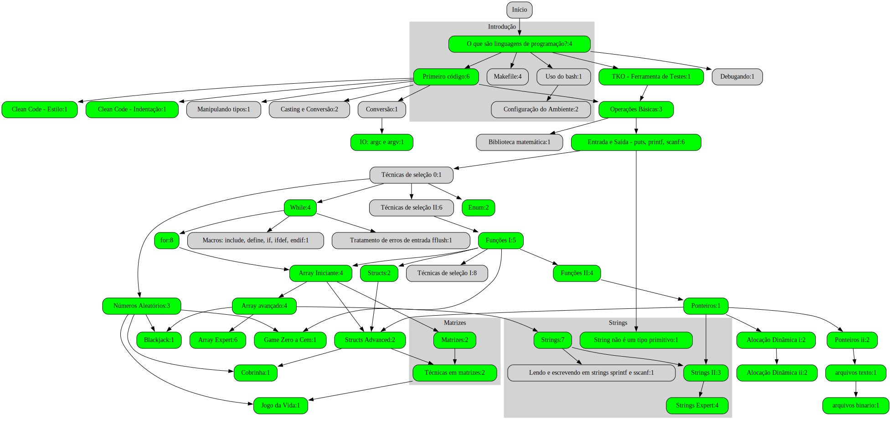

# FUP is FUN

- [Instruções aos Monitores](wiki/intro/instrucoes_monitores.md)

Clique para abrir a versão clicável

## Introdução <!-- group -->

### O que são linguagens de programação? <!-- @tools_basic -->

- [ ] [O que são algoritmos?](wiki/intro/o_que_sao_algoritmos.md)
- [ ] [Exemplos de códigos e linguagens](wiki/intro/exemplos.md)
- [ ] [Ferramentas úteis](wiki/configure/ferramentas_uteis.md) File Manager, Terminal, Text Editor
- [ ] [IDE: Replit](wiki/configure/replit.md)

### Primeiro código <!-- @types_basic r:tools_basic t:7 -->

- [ ] [Primeiro código](wiki/primeiro_codigo/primeiro_codigo.md)
- [ ] [Compilando e Executando](wiki/compilando/Readme.md)
- [ ] [Segundo código](wiki/intro/segundo_codigo.md)
- [ ] [Tipos de dados primitivos](wiki/variaveis/tipos_primitivos.md)
- [ ] [Variáveis](wiki/variaveis/variaveis.md): Boas práticas
- [ ] [Não tenha medo de erros](wiki/erros/variaveis.md) <!-- opt -->

### Montando seu setup local <!-- @local opt r:tools_basic t:7 -->

- [ ] [Uso do Bash e Instalação do Git Bash](wiki/configure/bash_git.md)
- [ ] [Instalação do C (Mingw)](wiki/configure/mingw.md)
- [ ] [IDE: Visual Studio Code (vscode)](wiki/configure/vscode.md)
- [ ] [Práticando com as ferramentas](wiki/configure/praticando.md)

### TKO - Ferramenta de Testes <!-- @tko r:tools_basic -->

- [ ] [Ferramenta de Testes: TKO](wiki/tko/Readme.md)
- [ ] [tko down - Baixando as atividades do repositórios](wiki/tko/repositorios.md)
- [ ] [tko run - Rodando livremente e com os casos de teste](wiki/tko/tko_run.md)
- [ ] [tko play - Marcando o que foi feito no modo jogo](wiki/tko/tko_play.md)

### Biblioteca para desenhos <!-- @tools_draw opt r:tools_basic -->

- [ ] [Biblioteca para desenhos XPaint](wiki/draw/draw.md)

### Técnicas de Debug <!-- @tools_debug opt r:select_novice -->

- [ ] [Debugando o primeiro código](wiki/debugando/intro.md)
- [ ] [Encontre o erro nesses códigos usando debug](wiki/debugando/erros.md) TODO
- [ ] [Como debugar um código com entrada e saída variáveis](wiki/debugando/io.md) TODO

### Clean Code <!-- @style r:types_basic -->

- [ ] [Aprenda a indentar](wiki/intro/indentacao.md)
- [ ] [Treinando indentação](wiki/intro/indentacao_treino.md)
- [ ] [Guia de estilo de escrita](wiki/intro/estilo.md)
- [ ] [Treinando estilo de escrita](wiki/intro/estilo_treino.md)

### Tipos e casting <!-- @types_casting opt r:types_basic -->

- [ ] [Limites e Modificadores de tipo](wiki/modificadores/modificadores.md)
- [ ] [Conversão entre tipos (casting)](wiki/variaveis/casting.md)
- [ ] [Conversão Implícita de tipos](wiki/variaveis/implicit_casting.md)
- [ ] [Conversões com strings](wiki/variaveis/strtol_strtod.md)
- [ ] [Strings em C](wiki/string/tipo_string.md)

## Entrada e Saída <!-- group -->

### Operações Básicas <!-- @types_operations r:types_basic r:tko -->

- [ ] [Atribuição e incremento](wiki/atribuicao_incremento/Readme.md) 
- [ ] [Operações aritméticas s:, -, *, /](wiki/operacoes/operacoes.md)
- [ ] [Problema da divisão de dois inteiros](wiki/problema_divisao_inteiros/problema_divisao_inteiros.md)
- [ ] [math.h (pow, sqrt)](wiki/biblioteca_math/Readme.md)
- [ ] [@pintando a casa](https://github.com/qxcodefup/arcade/blob/master/base/000/Readme.md)

### Entrada e Saída - puts, printf, scanf <!-- @io_basic r:types_operations -->

- [ ] [Entrada de dados básica com cin](wiki/entrada/Readme.md)
- [ ] [Impressão formatada](wiki/impressao_formatada/Readme.md)
- [ ] [L1 - @operacoes básicas](https://github.com/qxcodefup/arcade/blob/master/base/operacoes/Readme.md)
- [ ] [L2 - @opala bebedor](https://github.com/qxcodefup/arcade/blob/master/base/opala/Readme.md)

### Manipulando strings com `sprintf` e `sscanf` <!-- @io_string opt r:string_novice -->

- [ ] [Básico sobre `sprintf` e `sscanf`](wiki/string/sprintf_sscanf.md)
- [ ] [Usando para Serialização e Desseliarização](wiki/string/serializacao_c.md)
- [ ] [Strings e Structs com o Seu @frutolino](wiki/atividades/@frutolino/Readme.md)

### Tratamento de erros de entrada fflush  <!-- @io_error opt r:repeat_novice -->

- [ ] [argc e argv](wiki/argc_argv/Readme.md)

### IO: argc e argv <!-- @io_argc_argv opt r:string_novice -->

- [ ] [Tópicos extras e boas práticas](wiki/argc_argv/extra.md)

## Seleção <!-- group -->

### Seleção Básica <!-- @select_novice r:io_basic r:style -->

- [ ] [Estruturas de seleção](wiki/selecao/selecao_if_else.md)
- [ ] [Técnica da seleção intervalada](wiki/selecao/selecao_tecnica_intervalos.md)
- [ ] [Operador ternário](wiki/operadores/ternario.md)
- [ ] resolvido: [L1 - @calculadora Numérica](https://github.com/qxcodefup/arcade/blob/master/base/calculadora/Readme.md)
- [ ] resolvido: [L1 - Plantação de @morangos](https://github.com/qxcodefup/arcade/blob/master/base/morangos/Readme.md)
- [ ] [L1 - @chaves - Positivo, Nulo ou Negativo?](https://github.com/qxcodefup/arcade/blob/master/base/chaves/Readme.md),
- [ ] [L1 - Cláusulas de @guarda](https://github.com/qxcodefup/arcade/blob/master/base/guarda/Readme.md)
- [ ] [L2 - Fiquei de @final](https://github.com/qxcodefup/arcade/blob/master/base/final/Readme.md)
- [ ] [L2 - Está @trabalhando ou não](https://github.com/qxcodefup/arcade/blob/master/base/trabalhando/Readme.md)
- [ ] [L2 - Triângulo de @varetas](https://github.com/qxcodefup/arcade/blob/master/base/varetas/Readme.md)

### Técnicas de seleção I <!-- @select_advanced opt r:functions -->

- [ ] [Operadores lógicos &&, ||, ==, ()](wiki/operadores/logicos.md)
- [ ] [Técnicas de if e else](wiki/selecao/selecao_tecnica_agrupamento.md)
- [ ] [L1 - @quantos são iguais](https://github.com/qxcodefup/arcade/blob/master/base/quantos/Readme.md)
- [ ] [L2 - Aumento de @salario](https://github.com/qxcodefup/arcade/blob/master/base/salario/Readme.md)
- [ ] [L2 - @jokenpo das tartarugas](https://github.com/qxcodefup/arcade/blob/master/base/jokenpo/Readme.md)
- [ ] [L2 - Criança ou @mumia](https://github.com/qxcodefup/arcade/blob/master/base/mumia/Readme.md)
- [ ] [L2 - Jogo de par ou @impar - OBI 2016 - F1P1](https://github.com/qxcodefup/arcade/blob/master/base/impar/Readme.md)
- [ ] [L2 - Nota @cortada - OBI 2019 F1P1](https://github.com/qxcodefup/arcade/blob/master/base/cortada/Readme.md)

### Técnicas de seleção II <!-- @select_expert opt r:select_advanced -->

- [ ] [Switch case](wiki/selecao/seleção_switch_case.md)
- [ ] [Operador de módulo](wiki/operadores/modulo.md)
- [ ] [Exercícios de módulo](wiki/exercicios_modulo/Readme.md)
- [ ] [L1 - Ambos @divisiveis](https://github.com/qxcodefup/arcade/blob/master/base/divisiveis/Readme.md)
- [ ] [L2 - @teleferico - OBI 2017 - Fase 1](https://github.com/qxcodefup/arcade/blob/master/base/teleferico/Readme.md)
- [ ] [L2 - Ladrão de @goiabas](https://github.com/qxcodefup/arcade/blob/master/base/goiabas/Readme.md)
- [ ] [L2 - @quiz do Harry Potter](https://github.com/qxcodefup/arcade/blob/master/base/quiz/Readme.md)
- [ ] [L2 - Removendo @loops no ângulo Cartesiano](https://github.com/qxcodefup/arcade/blob/master/base/loops/Readme.md)
- [ ] [L2 - Cabeça da @cobra](https://github.com/qxcodefup/arcade/blob/master/base/cobra/Readme.md)
- [ ] [L3 - Formiga da @bundona](https://github.com/qxcodefup/arcade/blob/master/base/bundona/Readme.md)

## Repetição <!-- group -->

### While <!-- @repeat_novice r:select_novice -->

- [ ] [while(true), continue e break](wiki/repeticao/while_break_continue.md)
- [ ] [L1 - Soma dos @pares](https://github.com/qxcodefup/arcade/blob/master/base/pares/Readme.md)
- [ ] [L1 - @sapatos para 3](https://github.com/qxcodefup/arcade/blob/master/base/sapatos/Readme.md)
- [ ] [L2 - @fuga em helicóptero - OBI 2016](https://github.com/qxcodefup/arcade/blob/master/base/fuga/Readme.md)

### Usando o For <!-- @repeat_advanced r:repeat_novice -->

- [ ] [Aula 13 - Uso do for](wiki/repeticao/repeticao_for.md)
- [ ] [L2 - Jogo da @concentracao](https://github.com/qxcodefup/arcade/blob/master/base/concentracao/Readme.md),
- [ ] [L2 - É @primo](https://github.com/qxcodefup/arcade/blob/master/base/primo/Readme.md)
- [ ] [L2 - Ônibus @lotado](https://github.com/qxcodefup/arcade/blob/master/base/lotado/Readme.md)
- [ ] [L2 - @fatores de um número](https://github.com/qxcodefup/arcade/blob/master/base/fatores/Readme.md),
- [ ] [L2 - @sapinho 1 no Poço](https://github.com/qxcodefup/arcade/blob/master/base/sapinho/Readme.md),
- [ ] [L3 - Sapinho 2 morrendo no @poco](https://github.com/qxcodefup/arcade/blob/master/base/poco/Readme.md),
- [ ] [L3 - Quebrador de @copos](https://github.com/qxcodefup/arcade/blob/master/base/copos/Readme.md)

## Arrays <!-- group -->

### Array Iniciante <!-- @array_novice r:repeat_advanced r:functions -->

- [ ] [Array simples](wiki/array_simples/Readme.md)
- [ ] [L1 - @casamento](https://github.com/qxcodefup/arcade/blob/master/base/casamento/Readme.md)
- [ ] [L1 - @contagem](https://github.com/qxcodefup/arcade/blob/master/base/contagem/Readme.md)
- [ ] [L1 - Calça @apertada](https://github.com/qxcodefup/arcade/blob/master/base/apertada/Readme.md)

### Array avançado <!-- @array_advanced r:array_novice -->

- [ ] [L2 - Cabo de Guerra @jedi](https://github.com/qxcodefup/arcade/blob/master/base/jedi/Readme.md)
- [ ] [L3 - @pedra na lua](https://github.com/qxcodefup/arcade/blob/master/base/pedra/Readme.md)
- [ ] [L2 - @busca Intervalada](https://github.com/qxcodefup/arcade/blob/master/base/busca/Readme.md)
- [ ] [L3 - @piao perto da linha](https://github.com/qxcodefup/arcade/blob/master/base/piao/Readme.md)

### Array Expert <!-- @array_expert opt r:array_advanced -->

- [ ] [Vector](wiki/vetores/vector.md)
- [ ] [For Indexado](wiki/repeticao/for_indexado.md)
- [ ] [L2 - @fila do RU - Separar Pares e Ímpares](https://github.com/qxcodefup/arcade/blob/master/base/fila/Readme.md)
- [ ] [L2 - @invertendo vetor](https://github.com/qxcodefup/arcade/blob/master/base/invertendo/Readme.md)
- [ ] [L2 - Jogo do @avesso](https://github.com/qxcodefup/arcade/blob/master/base/avesso/Readme.md)
- [ ] [L2 - @mediana](https://github.com/qxcodefup/arcade/blob/master/base/mediana/Readme.md)

## Strings <!-- group -->

### Strings I <!-- @string_novice r:array_advanced -->

- [ ] [Tabela ASCII](wiki/string/tabela_asc2.md)
- [ ] [Manipulação de caracteres](wiki/manipulacao_caracteres/Readme.md)
- [ ] [Métodos da classe string](wiki/metodos_string/metodos_string.md)
- [ ] [Métodos  e](wiki/split_join/Readme.md)
- [ ] [L1 - Eribelton e a @ascologia V1 - Somar Asc](https://github.com/qxcodefup/arcade/blob/master/base/ascologia/Readme.md),

### Strings II <!-- @string_advanced opt r:string_novice r:pointers_novice -->

- [ ] [L1 - LP da @xuxa - Inverter String](https://github.com/qxcodefup/arcade/blob/master/base/xuxa/Readme.md)
- [ ] [L1 - @valdiskley e a cifra V1](https://github.com/qxcodefup/arcade/blob/master/base/valdiskley/Readme.md)
- [ ] [L2 - Contar @leds](https://github.com/qxcodefup/arcade/blob/master/base/leds/Readme.md)

### Strings Expert <!-- @string_expert opt r:string_advanced -->

- [ ] [L2 - @gritando em Caixa Alta - Invertendo o Case da frase](https://github.com/qxcodefup/arcade/blob/master/base/gritando/Readme.md)
- [ ] [L2 - @jokenpozao de 9](https://github.com/qxcodefup/arcade/blob/master/base/jokenpozao/Readme.md)
- [ ] [L3 - MeU @word QuEbRoU - formatação de case](https://github.com/qxcodefup/arcade/blob/master/base/word/Readme.md)
- [ ] [L3 - Separe Pneumatócito - @silabas](https://github.com/qxcodefup/arcade/blob/master/base/silabas/Readme.md)

## Outros Tipos <!-- group -->

### Enum <!-- @enum r:functions -->

- [ ] [Enum: Introdução](wiki/enum/introducao.md)

### Structs <!-- @structs_novice r:enum -->

- [ ] [Structs: Introdução](wiki/structs/introducao.md)
- [ ] [Structs: Exemplos](wiki/structs/exemplos.md)

### Structs Advanced <!-- @structs_advanced r:pointers_novice r:array_novice r:structs_novice -->

- [ ] [Structs: Ponteiros e Referências](wiki/structs/ponteiros_referencias.md)
- [ ] [Structs: Funções e Métodos](wiki/structs/funcoes_metodos.md)

### Matrizes básico <!-- @matrix_novice r:array_novice -->

- [ ] [O que são matrizes e para que usar?](wiki/matrizes/o_que_sao_matrizes.md)
- [ ] [Noções básicas sobre matrizes: diagonais e outras propriedades](wiki/matrizes/nocoes_basicas_de_matrizes.md)

### Técnicas em matrizes <!-- @matrix_advanced opt r:matrix_novice r:structs_advanced -->

- [ ]  [filler](https:filler.com.br)

## Modularizando <!-- group -->

### Funções I <!-- @functions r:select_novice -->

- [ ] [Variáveis locais e globais](wiki/variaveis/variaveis_locais_e_globais.md)
- [ ] [Tratando Conflitos de Nomes com Namespaces](wiki/conflitos_e_namespaces/Readme.md)
- [ ] [Funções: parâmetros e retornos](wiki/funcao/parametros_e_retornos.md)
- [ ] [L2 - @mmc](https://github.com/qxcodefup/arcade/blob/master/base/mmc/Readme.md)
- [ ] [L2 - Soldados @pmg](https://github.com/qxcodefup/arcade/blob/master/base/pmg/Readme.md)

### Funções II <!-- @function_advanced r:functions -->

- [ ] [Retornando no meio da função](wiki/funcao/retornando_no_meio_da_funcao.md)
- [ ] [Debugando em funções](wiki/debugando/funcoes.md)
- [ ] [Variáveis estáticas em funções](wiki/variaveis/variaveis_estaticas_em_funcoes.md)
- [ ] [Valores default em funções](wiki/variaveis/valores_default_em_funcoes.md)

### Criando um projeto modular <!-- @modular opt r:functions -->

- [ ] [Criando um projeto modular](wiki/modular/modular.md)

### Makefile <!-- @makefile opt r:modular -->

- [ ] [O que é Makefile?](wiki/makefile/makefile_intro.md)
- [ ] [Makefile e a linguagem C](wiki/makefile/makefile_c.md)
- [ ] [Extras](wiki/makefile/makefile_extra.md)

### Macros: Preprocessador  <!-- @macros opt r:modular -->

- [ ] [Vídeos sobre diretivas](https://www.youtube.com/watch?v=asDaFDq8VSs)
- [ ] [Macros e onde aplicar](wiki/macros/macro_introducao.md)
- [ ] [Macros e Multiplataforma](wiki/macros/macro_multiplataforma.md)

### Recursividade

### Ponteiros <!-- @pointers_novice r:function_advanced -->

- [ ] [Ponteiros: Introdução](wiki/ponteiros/introducao.md)

### Ponteiros ii <!-- @pointers_advanced r:pointers_novice -->

- [ ] [Ponteiros e Funções](wiki/ponteiros/funcoes.md)

- [ ] filler
- [ ] filler 2

### Alocação Dinâmica i <!-- @memory_novice opt r:pointers_novice -->

- [ ] [Alocação Dinâmica: Introdução](wiki/alocacao_dinamica/introducao.md)

### Alocação Dinâmica ii <!-- @memory_advanced opt r:memory_novice -->

- [ ] [Strings, Matrizes e Strucs](wiki/alocacao_dinamica/funcoes_ponteiros.md)

### arquivos texto <!-- @files_novice r:pointers_advanced -->

- [ ] filler

### arquivos binario <!-- @files_advanced opt r:files_novice -->

- [ ] filler 2

## Jogos <!-- group -->

### Números Aleatórios <!-- @tools_rand r:select_novice -->

- [ ] [Números Aleatórios: Introdução](wiki/rand/num_aleatorios_introducao.md)
- [ ] [As funções e](wiki/rand/rand_e_srand.md)

### Game Zero a Cem <!-- @game_zero_cem c:cyan r:tools_rand r:functions -->

- [ ] [L1 - @zero a cem](wiki/game_zero_cem/Readme.md)

### Jogo da Vida <!-- @game_jogodavida c:cyan r:tools_rand r:matrix_advanced -->

- [ ] [L2 - @jogo da vida](wiki/game_jogodavida/Readme.md)

### Blackjack <!-- @game_blackjack c:cyan r:tools_rand r:array_advanced -->

- [ ] [L2 - @blackjack](wiki/game_blackjack/Readme.md)

### Cobrinha <!-- @game_cobrinha c:cyan r:tools_rand r:structs_advanced -->

- [ ] [L2 - @cobrinha](wiki/game_cobrinha/Readme.md)
