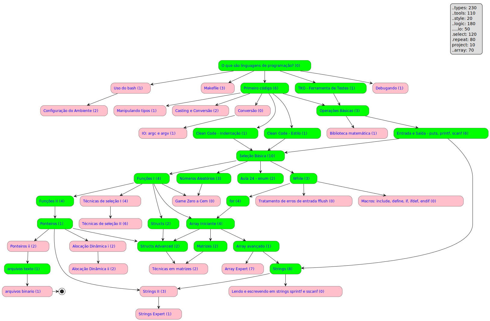

# FUP is FUN

- [Instruções aos Monitores](../wiki/intro/instrucoes_monitores.md)

## Flow

[Clique aqui](https://raw.githubusercontent.com/senapk/c_is_fun/main/graph/graph.svg) e abra em uma nova aba para carregar links clicáveis.

### O que são linguagens de programação?<!-- l:tools_basic t:main s:tools -->

- [x] [O que são algoritmos?](../wiki/intro/o_que_sao_algoritmos.md)
- [x] [Exemplos de códigos e linguagens](../wiki/intro/exemplos.md)
- [x] [Ferramentas úteis](../wiki/configure/ferramentas_uteis.md) File Manager, Terminal, Text Editor

- [x] [IDE: Replit](../wiki/configure/replit.md)

### Uso do bash<!-- l:tools_bash t:side r:tools_basic s:tools -->

- [ ] [Uso do Bash e Instalação do Git Bash](../wiki/configure/bash_git.md)

### Configuração do Ambiente<!-- l:tools_local_ide r:tools_bash t:side s:tools -->

- [ ] [Instalação do C (Mingw)](../wiki/configure/cpp.md)
- [ ] [IDE: Visual Studio Code (vscode)](../wiki/configure/vscode.md)

### Makefile<!-- l:tools_makefile t:side r:tools_basic s:tools -->

- [ ] filler
- [ ] filler
- [ ] filler

### Primeiro código<!-- l:types_basic r:tools_basic t:main s:types -->

- [ ] [Primeiro código](../wiki/primeiro_codigo/primeiro_codigo.md)
- [ ] [Compilando e Executando](../wiki/compilando/Readme.md)
- [ ] [Segundo código](../wiki/intro/segundo_codigo.md)
- [ ] [Tipos de dados primitivos](../wiki/variaveis/tipos_primitivos.md)
- [ ] [Variáveis](../wiki/variaveis/variaveis.md): Boas práticas
- [ ] [Não tenha medo de erros](../wiki/erros/variaveis.md)

### O tipo string<!-- l:string_novice t:main r:io_basic s:types -->

- [ ] [O tipo string](../wiki/string/tipo_string.md)

### Clean Code - Estilo<!-- l:style_guide t:main r:types_basic s:style -->

- [ ] [Guia de estilo de escrita](../wiki/intro/estilo.md)

### Clean Code - Indentação<!-- l:style_indentation t:main r:types_basic s:style -->

- [ ] [Aprenda a indentar](../wiki/intro/indentacao.md)

### Manipulando tipos<!-- l:types_modifiers t:side r:types_basic s:types -->

- [ ] [Limites e Modificadores de tipo](../wiki/modificadores/modificadores.md)

### Casting e Conversão<!-- l:types_casting t:side r:types_basic s:types -->

- [ ] [Conversão entre tipos (casting)](../wiki/variaveis/casting.md)
- [ ] [stoi stod strtol strtod]()

### Conversão<!-- l:types_conversion t:side r:types_basic s:types -->

### Operações Básicas<!-- l:types_operations t:main r:types_basic r:tools_tko s:logic -->

- [ ] [Atribuição e incremento](../wiki/atribuicao_incremento/Readme.md)
- [ ] [Operações aritméticas s:, -, *, /](../wiki/operacoes/operacoes.md)
- [ ] [Problema da divisão de dois inteiros](../wiki/problema_divisao_inteiros/problema_divisao_inteiros.md)

### Biblioteca matemática<!-- l:tools_math.h t:side r:types_operations s:logic -->

- [ ] [math.h (pow, sqrt)](../wiki/biblioteca_math/Readme.md)

### Entrada e Saída - puts, printf, scanf<!-- l:io_basic t:main r:types_operations s:io -->

- [ ] [Entrada de dados básica com cin](../wiki/entrada/Readme.md)
- [ ] [Impressão formatada](../wiki/impressao_formatada/Readme.md)
- [ ] [@000 Operações Básicas](https://github.com/qxcodefup/arcade/blob/master/base/000/Readme.md)
- [ ] [@002 Pintando a casa](https://github.com/qxcodefup/arcade/blob/master/base/000/Readme.md)
- [ ] [@003 Opala Bebedor](https://github.com/qxcodefup/arcade/blob/master/base/003/Readme.md),
- [ ] [@196 Comprando TV Parcelada](https://github.com/qxcodefup/arcade/blob/master/base/196/Readme.md)

### Lendo e escrevendo em strings sprintf e sscanf<!-- l:io_string t:side r:string_novice s:io -->

### Tratamento de erros de entrada fflush<!-- l:io_error t:side r:repeat_novice s:io -->

### Macros: include, define, if, ifdef, endif<!-- l:tools_macros t:side r:repeat_novice s:tools -->

### TKO - Ferramenta de Testes<!-- l:tools_tko t:main r:tools_basic s:tools -->

- [ ] [Ferramenta de Testes: TKTest](../wiki/tko/Readme.md)

### Seleção Básica<!-- l:select_novice t:main r:io_basic r:style_guide r:style_indentation s:select -->

- [ ] [Estruturas de seleção](../wiki/selecao/selecao_if_else.md)
- [ ] [Técnica da seleção intervalada](../wiki/selecao/selecao_tecnica_intervalos.md)
- [ ] [Operador ternário](../wiki/operadores/ternario.md)
- [ ] resolvido: [@015 Calculadora Numérica](https://github.com/qxcodefup/arcade/blob/master/base/015/Readme.md),
- [ ] resolvido: [@155 Plantação de Morangos](https://github.com/qxcodefup/arcade/blob/master/base/155/Readme.md)
- [ ] classe: [@026 Positivo, Nulo ou Negativo?](https://github.com/qxcodefup/arcade/blob/master/base/026/Readme.md),
- [ ] classe: [@031 Fiquei de Final](https://github.com/qxcodefup/arcade/blob/master/base/031/Readme.md)
- [ ] casa: [@203 Cláusulas de Guarda](https://github.com/qxcodefup/arcade/blob/master/base/203/Readme.md)
- [ ] casa: [@040 Está Trabalhando ou Não?](https://github.com/qxcodefup/arcade/blob/master/base/040/Readme.md)
- [ ] casa: [@164 Triângulo de Varetas](https://github.com/qxcodefup/arcade/blob/master/base/164/Readme.md)

### Debugando<!-- l:tools_debug t:side r:tools_basic s:tools -->

- [ ] [Debugando o primeiro código](../wiki/debugando/intro.md)

### Técnicas de seleção I<!-- l:select_advanced t:side r:functions_novice s:select s:logic -->

- [ ] [Operadores lógicos &&, ||, ==, ()](../wiki/operadores/logicos.md)
- [ ] [Técnicas de if e else](../wiki/selecao/selecao_tecnica_agrupamento.md)
- [ ] Exercícios Classe:
  [@014 Quantos são Iguais?](https://github.com/qxcodefup/arcade/blob/master/base/014/Readme.md),
  [@021 Aumento de Salário](https://github.com/qxcodefup/arcade/blob/master/base/021/Readme.md),
- [ ] Exercícios Casa:
  [@023 Jokenpo das Tartarugas!](https://github.com/qxcodefup/arcade/blob/master/base/023/Readme.md)
  [@183 Criança ou Múmia](https://github.com/qxcodefup/arcade/blob/master/base/183/Readme.md),
  [@156 Jogo de Par ou Ímpar](https://github.com/qxcodefup/arcade/blob/master/base/156/Readme.md),
  [@194 Nota Cortada](https://github.com/qxcodefup/arcade/blob/master/base/194/Readme.md)

### Técnicas de seleção II<!-- l:select_expert t:side r:select_advanced s:select s:logic -->

- [ ] [Switch case](../wiki/selecao/seleção_switch_case.md)
- [ ] [Operador de módulo](../wiki/operadores/modulo.md)
- [ ] [Exercícios de módulo](../wiki/exercicios_modulo/Readme.md)
- [ ] Exercícios Resolvidos:
  [@022 Teleférico](https://github.com/qxcodefup/arcade/blob/master/base/022/Readme.md)
- [ ] Exercícios Classe:
  [@025 Ambos Divisíveis](https://github.com/qxcodefup/arcade/blob/master/base/025/Readme.md),
  [@005 Ladrão de Goiabas](https://github.com/qxcodefup/arcade/blob/master/base/005/Readme.md),
- [ ] Exercícios Casa:
  [@029 Quiz do Harry Potter](https://github.com/qxcodefup/arcade/blob/master/base/029/Readme.md),
  [@062 Ângulo Cartesiano](https://github.com/qxcodefup/arcade/blob/master/base/062/Readme.md)
  [@028 Cabeça da Cobra](https://github.com/qxcodefup/arcade/blob/master/base/028/Readme.md),
  [@034 Formiga da Bundona](https://github.com/qxcodefup/arcade/blob/master/base/034/Readme.md)

### Funções I<!-- l:functions_novice t:main r:select_novice s:types -->

- [ ] [Variáveis locais e globais](../wiki/variaveis/variaveis_locais_e_globais.md)
- [ ] [Tratando Conflitos de Nomes com Namespaces](../wiki/conflitos_e_namespaces/Readme.md)
- [ ] [Funções: parâmetros e retornos](../wiki/funcao/parametros_e_retornos.md)
- [ ] Exercícios Classe:
  [@091 MMC](https://github.com/qxcodefup/arcade/blob/master/base/091/Readme.md),
  [@072 Soldados PMG!](https://github.com/qxcodefup/arcade/blob/master/base/072/Readme.md)

### Funções II<!-- l:function_advanced t:main r:functions_novice s:logic -->

- [ ] [Retornando no meio da função](../wiki/funcao/retornando_no_meio_da_funcao.md)
- [ ] [Debugando em funções](../wiki/debugando/funcoes.md)
- [ ] [Variáveis estáticas em funções](../wiki/variaveis/variaveis_estaticas_em_funcoes.md)
- [ ] [Valores default em funções](../wiki/variaveis/valores_default_em_funcoes.md)

### While<!-- l:repeat_novice t:main r:select_novice s:repeat -->

- [ ] [while(true), continue e break](../wiki/repeticao/while_break_continue.md)
- [ ] Exercícios Classe:
  [@045 Soma dos Pares](https://github.com/qxcodefup/arcade/blob/master/base/045/Readme.md)
- [ ] Exercícios Casa:
  [@013 Sapatos para 3](https://github.com/qxcodefup/arcade/blob/master/base/013/Readme.md),
  [@053 Fuga em Helicóptero](https://github.com/qxcodefup/arcade/blob/master/base/053/Readme.md)

### for<!-- l:repeat_advanced t:main r:repeat_novice s:repeat -->

- [ ] [Aula 13 - Uso do for](../wiki/repeticao/repeticao_for.md)
- [ ] Exercícios Resolvidos:
  [@046 Jogo da Concentração](https://github.com/qxcodefup/arcade/blob/master/base/046/Readme.md),
  [@090 Primo](https://github.com/qxcodefup/arcade/blob/master/base/090/Readme.md)
- [ ] Exercícios Classe:
  [@047 Ônibus Lotado](https://github.com/qxcodefup/arcade/blob/master/base/047/Readme.md)
- [ ] Exercícios Casa:
  [@189 Fatores de um número](https://github.com/qxcodefup/arcade/blob/master/base/189/Readme.md),
  [@049 Sapinho 1 no Poço](https://github.com/qxcodefup/arcade/blob/master/base/049/Readme.md),
  [@059 Sapinho 2 Morrendo no Poço](https://github.com/qxcodefup/arcade/blob/master/base/059/Readme.md),
  [@054 Quebrador de Copos](https://github.com/qxcodefup/arcade/blob/master/base/054/Readme.md)

### Números Aleatórios<!-- l:tools_rand t:main r:select_novice s:tools -->

- [ ] [Números Aleatórios: Introdução](../wiki/rand/num_aleatorios_introducao.md)
- [ ] [As funções `rand()` e `srand()`](../wiki/rand/rand_e_srand.md)
- [ ] [Gerando números aleatórios com o Mersenne Twister](../wiki/mersenne/Readme.md)

### Game Zero a Cem<!-- l:game_zero_cem t:side r:tools_rand r:functions_novice s:project -->

### argc e argv<!-- l:io_argc_argv t:side r:types_conversion s:io -->

- [ ] [argc e argv](../wiki/argc_argv/Readme.md)

### Array Iniciante<!-- l:array_novice t:main r:repeat_advanced r:functions_novice s:types -->

- [ ] [Array simples](../wiki/array_simples/Readme.md)
- [ ] Exercícios Resolvidos:
  [@060 Casamento](https://github.com/qxcodefup/arcade/blob/master/base/060/Readme.md)
- [ ] Exercícios Classe:
  [@055 Contagem](https://github.com/qxcodefup/arcade/blob/master/base/055/Readme.md),
  [@056 Calça Apertada](https://github.com/qxcodefup/arcade/blob/master/base/056/Readme.md)

### Array avançado<!-- l:array_advanced t:main r:array_novice s:logic s:select s:repeat -->

- [ ] Exercícios Casa:
  [@048 Cabo de Guerra Jedi](https://github.com/qxcodefup/arcade/blob/master/base/048/Readme.md),
  [@051 Pedra na Lua](https://github.com/qxcodefup/arcade/blob/master/base/051/Readme.md),
  [@058 Busca Intervalada](https://github.com/qxcodefup/arcade/blob/master/base/051/Readme.md),
  [@100 Pião Perto da Linha](https://github.com/qxcodefup/arcade/blob/master/base/100/Readme.md)

### Array Expert<!-- l:array_expert t:side r:array_advanced s:logic s:select s:repeat -->

- [ ] [Vector](../wiki/vetores/vector.md)
- [ ] [For Indexado](../wiki/repeticao/for_indexado.md)
- [ ] Exercícios Casa:
  [@068 Fila do RU](https://github.com/qxcodefup/arcade/blob/master/base/068/Readme.md),
  [@061 Invertendo Vetor](https://github.com/qxcodefup/arcade/blob/master/base/061/Readme.md),
  [@078 Jogo do Avesso](https://github.com/qxcodefup/arcade/blob/master/base/078/Readme.md),
  [@088 Mediana](https://github.com/qxcodefup/arcade/blob/master/base/088/Readme.md)

### Aula 16

- [ ] [Cópia e Referência](../wiki/copia_e_referencia/Readme.md)
- [ ] [For-each e loops com referência](../wiki/repeticao/foreach.md)

## Bloco - Texto

### Strings<!-- l:string_novice t:main r:array_advanced s:types s:select -->

- [Tabela ASC](../wiki/string/tabela_asc2.md)
- [Manipulação de caracteres](../wiki/manipulacao_caracteres/Readme.md)
- [Métodos da classe string](../wiki/metodos_string/metodos_string.md)
- [ ] [Métodos `split()` e `join()`](../wiki/split_join/Readme.md)
- [ ] [Stringstream e Manipulação de Streams](../wiki/string/stringstream.md)
- [ ] Exercícios Classe:
  [@173 Eribelton e a Ascologia V1](https://github.com/qxcodefup/arcade/blob/master/base/173/Readme.md),
  [@104 Maiúsculo, Minusculo e Dígito!](https://github.com/qxcodefup/arcade/blob/master/base/104/Readme.md)

### Strings II<!-- l:string_advanced t:side r:string_novice r:pointers_novice s:select -->

  [@092 LP da Xuxa - Inverter String](https://github.com/qxcodefup/arcade/blob/master/base/092/Readme.md),
  [@174 Valdiskey e a cifra V1!](https://github.com/qxcodefup/arcade/blob/master/base/174/Readme.md),
  [@096 Contar Leds](https://github.com/qxcodefup/arcade/blob/master/base/096/Readme.md),

### Strings Expert<!-- l:string_expert t:side r:string_advanced s:logic s:repeat s:select -->

- [ ] Exercícios Casa:
  [@093 Gritando em Caixa Alta](https://github.com/qxcodefup/arcade/blob/master/base/093/Readme.md),
  [@089 Mega Jokenpo!](https://github.com/qxcodefup/arcade/blob/master/base/089/Readme.md),
  [@114 MeU WoRd QuEbRoU](https://github.com/qxcodefup/arcade/blob/master/base/114/Readme.md),
  [@103 Separe Pneumatocito](https://github.com/qxcodefup/arcade/blob/master/base/103/Readme.md)

### Ponteiros<!-- l:pointers_novice t:main r:function_advanced s:types -->

- [ ] [Ponteiros: Introdução](../wiki/ponteiros/introducao.md)

### Structs<!-- l:structs_novice t:main r:functions_novice s:types -->

- [ ] [Structs: Introdução](../wiki/structs/introducao.md)
- [ ] [Structs: Exemplos](../wiki/structs/exemplos.md)

### Matrizes<!-- l:matrix_novice t:main r:array_novice s:types -->

- [ ] [O que são matrizes e para que usar?](../wiki/matrizes/o_que_sao_matrizes.md)
- [ ] [Noções básicas sobre matrizes: diagonais e outras propriedades](../wiki/matrizes/nocoes_basicas_de_matrizes.md)

### Técnicas em matrizes<!-- l:matrix_advanced t:side r:matrix_novice r:structs_advanced s:select s:logic s:repeat s:array -->

- [ ] filler
- [ ] filler 2

### Merged tecnique<!-- l:structs_advanced t:main r:pointers_novice r:array_novice r:structs_novice s:select s:logic s:repeat s:array -->

- [ ] [Structs: Ponteiros e Referências](../wiki/structs/ponteiros_referencias.md)
- [ ] [Structs: Funções e Métodos](../wiki/structs/funcoes_metodos.md)

### Aula 24 - enum<!-- l:enum t:main r:select_novice s:types -->

- [ ] filler
- [ ] filler 2

### Ponteiros ii<!-- l:pointers_advanced t:side r:pointers_novice s:types s:logic -->

- [ ] filler
- [ ] filler 2

### Alocação Dinâmica<!-- l:memory_novice t:side r:pointers_novice -->

### Alocação Dinâmica<!-- l:memory_advanced t:side r:memory_novice -->

- [ ] filler
- [ ] filler 2

### arquivos texto<!-- l:files_novice t:main r:pointers_advanced -->

- [ ] filler

### arquivos binario<!-- l:files_advanced t:side r:files_novice -->

- [ ] filler 2
