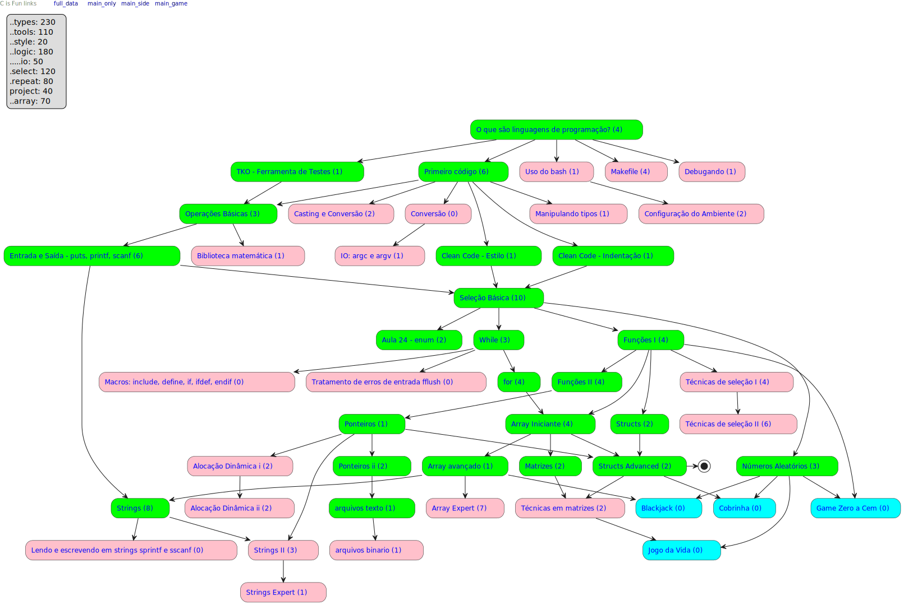

# FUP is FUN

- [Instruções aos Monitores](../wiki/intro/instrucoes_monitores.md)

## Flow

Clique para abrir a versão clicável

### O que são linguagens de programação? <!-- @tools_basic c:lime s:types:20 -->

- [ ] <!-- @001 -->[O que são algoritmos?](../wiki/intro/o_que_sao_algoritmos.md)
- [ ] <!-- @002 -->[Exemplos de códigos e linguagens](../wiki/intro/exemplos.md)
- [ ] <!-- @003 -->[Ferramentas úteis](../wiki/configure/ferramentas_uteis.md)
- [ ] <!-- @004 -->[IDE: Replit](../wiki/configure/replit.md)

### Uso do bash <!-- @tools_bash r:tools_basic c:pink s:tools:20 -->

- [ ] <!-- @005 -->[Uso do Bash e Instalação do Git Bash](../wiki/configure/bash_git.md)

### Configuração do Ambiente <!-- @tools_local_ide r:tools_bash c:pink s:tools:30 -->

- [ ] <!-- @006 -->[Instalação do C (Mingw)](../wiki/configure/cpp.md)
- [ ] <!-- @007 -->[IDE: Visual Studio Code (vscode)](../wiki/configure/vscode.md)

### Makefile <!-- @tools_makefile c:pink r:tools_basic s:tools:30 -->

- [ ] <!-- @008 -->[Vídeo de aprendizado](foo)
- [ ] <!-- @009 -->[O que é Makefile?](../wiki/makefile/makefile_intro.md)
- [ ] <!-- @010 -->[Makefile e a linguagem C](../wiki/makefile/makefile_c.md)
- [ ] <!-- @011 -->[Extras](../wiki/makefile/makefile_extra.md)

### Primeiro código <!-- @types_basic r:tools_basic c:lime s:types:30 -->

- [ ] <!-- @012 -->[Primeiro código](../wiki/primeiro_codigo/primeiro_codigo.md)
- [ ] <!-- @013 -->[Compilando e Executando](../wiki/compilando/Readme.md)
- [ ] <!-- @014 -->[Segundo código](../wiki/intro/segundo_codigo.md)
- [ ] <!-- @015 -->[Tipos de dados primitivos](../wiki/variaveis/tipos_primitivos.md)
- [ ] <!-- @016 -->[Variáveis](../wiki/variaveis/variaveis.md)
- [ ] <!-- @017 -->[Não tenha medo de erros](../wiki/erros/variaveis.md)

### String não é um tipo primitivo <!-- @string_basic c:lime r:io_basic s:types:20 -->

- [ ] <!-- @018 -->[O tipo string](../wiki/string/tipo_string.md)

### Clean Code - Estilo <!-- @style_guide c:lime r:types_basic s:style:10 -->

- [ ] <!-- @019 -->[Guia de estilo de escrita](../wiki/intro/estilo.md)

### Clean Code - Indentação <!-- @style_indentation c:lime r:types_basic s:style:10 -->

- [ ] <!-- @020 -->[Aprenda a indentar](../wiki/intro/indentacao.md)

### Manipulando tipos <!-- @types_modifiers c:pink r:types_basic s:types:10 -->

- [ ] <!-- @021 -->[Limites e Modificadores de tipo](../wiki/modificadores/modificadores.md)

### Casting e Conversão <!-- @types_casting c:pink r:types_basic s:types:10 -->

- [ ] <!-- @022 -->[Conversão entre tipos (casting)](../wiki/variaveis/casting.md)
- [ ] <!-- @023 -->[stoi stod strtol strtod]()

### Conversão <!-- @types_conversion c:pink r:types_basic s:types:10 -->

- [ ] <!-- @024 -->filler

### Operações Básicas <!-- @types_operations c:lime r:types_basic r:tools_tko s:logic:10 -->

- [ ] <!-- @025 -->[Atribuição e incremento](../wiki/atribuicao_incremento/Readme.md)
- [ ] <!-- @026 -->[Operações aritméticas s:, -, *, /](../wiki/operacoes/operacoes.md)
- [ ] <!-- @027 -->[Problema da divisão de dois inteiros](../wiki/problema_divisao_inteiros/Readme.md)

### Biblioteca matemática <!-- @tools_math.h c:pink r:types_operations s:logic:10 -->

- [ ] <!-- @028 -->[math.h (pow, sqrt)](../wiki/biblioteca_math/Readme.md)

### Entrada e Saída - puts, printf, scanf <!-- @io_basic c:lime r:types_operations s:io:10 -->

- [ ] <!-- @029 -->[Entrada de dados básica com cin](../wiki/entrada/Readme.md)
- [ ] <!-- @030 -->[Impressão formatada](../wiki/impressao_formatada/Readme.md)
- [ ] <!-- @031 -->[@operacoes básicas](https://github.com/qxcodefup/arcade/blob/master/base/operacoes/Readme.md)
- [ ] <!-- @032 -->[@pintando a casa](https://github.com/qxcodefup/arcade/blob/master/base/pintando/Readme.md)
- [ ] <!-- @033 -->[@opala bebedor](https://github.com/qxcodefup/arcade/blob/master/base/opala/Readme.md),
- [ ] <!-- @034 -->[@tv - Comprando parcelada](https://github.com/qxcodefup/arcade/blob/master/base/tv/Readme.md)

### Lendo e escrevendo em strings sprintf e sscanf <!-- @io_string c:pink r:string_novice s:io:10 -->

- [ ] <!-- @035 -->filler

### Tratamento de erros de entrada fflush<!-- @io_error c:pink r:repeat_novice s:io:10 -->

- [ ] <!-- @036 -->filler

### Macros: include, define, if, ifdef, endif<!-- @tools_macros c:pink r:repeat_novice  s:io:10 -->

- [ ] <!-- @037 -->filler

### TKO - Ferramenta de Testes<!-- @tools_tko c:lime r:tools_basic s:tools:10 -->

- [ ] <!-- @038 -->[Ferramenta de Testes: TKTest](../wiki/tko/Readme.md)

### Seleção Básica<!-- @select_novice c:lime r:io_basic r:style_guide r:style_indentation s:select:10 -->

- [ ] <!-- @039 -->[Estruturas de seleção](../wiki/selecao/selecao_if_else.md)
- [ ] <!-- @040 -->[Técnica da seleção intervalada](../wiki/selecao/selecao_tecnica_intervalos.md)
- [ ] <!-- @041 -->[Operador ternário](../wiki/operadores/ternario.md)
- [ ] <!-- @042 -->resolvido: [@015 Calculadora Numérica](https://github.com/qxcodefup/arcade/blob/master/base/015/Readme.md),
- [ ] <!-- @043 -->resolvido: [@155 Plantação de Morangos](https://github.com/qxcodefup/arcade/blob/master/base/155/Readme.md)
- [ ] <!-- @044 -->classe: [@026 Positivo, Nulo ou Negativo?](https://github.com/qxcodefup/arcade/blob/master/base/026/Readme.md),
- [ ] <!-- @045 -->classe: [@031 Fiquei de Final](https://github.com/qxcodefup/arcade/blob/master/base/031/Readme.md)
- [ ] <!-- @046 -->casa: [@203 Cláusulas de Guarda](https://github.com/qxcodefup/arcade/blob/master/base/203/Readme.md)
- [ ] <!-- @047 -->casa: [@040 Está Trabalhando ou Não?](https://github.com/qxcodefup/arcade/blob/master/base/040/Readme.md)
- [ ] <!-- @048 -->casa: [@164 Triângulo de Varetas](https://github.com/qxcodefup/arcade/blob/master/base/164/Readme.md)

### Debugando<!-- @tools_debug c:pink r:tools_basic s:tools:10 -->

- [ ] <!-- @049 -->[Debugando o primeiro código](../wiki/debugando/intro.md)

### Técnicas de seleção 0 <!-- @select_advanced s:select:10 s:logic:10 c:pink r:functions_novice -->

- [ ] <!-- @059 -->`play:` [Aula sobre operadores lógicos &&, ||, ==, ()](../wiki/operadores/logicos.md)
- [ ] <!-- @060 -->`read:` [@senapk Texto sobre técnicas de if e else](../wiki/selecao/selecao_tecnica_agrupamento.md)
- [ ] <!-- @061 -->`grow:` [@funcoes - Corrija os seguintes códigos](https://github.com/qxcodefup/arcade/blob/master/base/156/Readme.md)
- [ ] <!-- @062 -->`grow:` [@fsyntax - Treine a sintaxe de funções](https://github.com/qxcodefup/arcade/blob/master/base/156/Readme.md)
- [ ] <!-- @063 -->`flex:` [@fractal - Desenhe o fractal do triângulo](https://github.com/qxcodefup/arcade/blob/master/base/014/Readme.md)
- [ ] <!-- @064 -->`flex:` [@cobrinha - faça o jogo da cobrinha](https://github.com/qxcodefup/arcade/blob/master/base/021/Readme.md)
- [ ] <!-- @065 -->`eval:` [@jokenpo - Jokenpo das Tartarugas!](https://github.com/qxcodefup/arcade/blob/master/base/023/Readme.md)
- [ ] <!-- @066 -->`eval:` [@mumia - Criança ou Múmia](https://github.com/qxcodefup/arcade/blob/master/base/183/Readme.md)
- [ ] <!-- @067 -->`eval:` [@nota - Nota Cortada](https://github.com/qxcodefup/arcade/blob/master/base/194/Readme.md)

### Técnicas de seleção II<!-- @select_expert c:pink r:select_advanced s:select:10 s:logic:10 -->

- [ ] [Switch case](../wiki/selecao/seleção_switch_case.md)
- [ ] [Operador de módulo](../wiki/operadores/modulo.md)
- [ ] [Exercícios de módulo](../wiki/exercicios_modulo/Readme.md)
- [ ] [@022 Teleférico](https://github.com/qxcodefup/arcade/blob/master/base/022/Readme.md)
- [ ] [@025 Ambos Divisíveis](https://github.com/qxcodefup/arcade/blob/master/base/025/Readme.md)
- [ ] [@005 Ladrão de Goiabas](https://github.com/qxcodefup/arcade/blob/master/base/005/Readme.md)
- [ ] [@029 Quiz do Harry Potter](https://github.com/qxcodefup/arcade/blob/master/base/029/Readme.md)
- [ ] [@062 Ângulo Cartesiano](https://github.com/qxcodefup/arcade/blob/master/base/062/Readme.md)
- [ ] [@028 Cabeça da Cobra](https://github.com/qxcodefup/arcade/blob/master/base/028/Readme.md)
- [ ] [@034 Formiga da Bundona](https://github.com/qxcodefup/arcade/blob/master/base/034/Readme.md)

