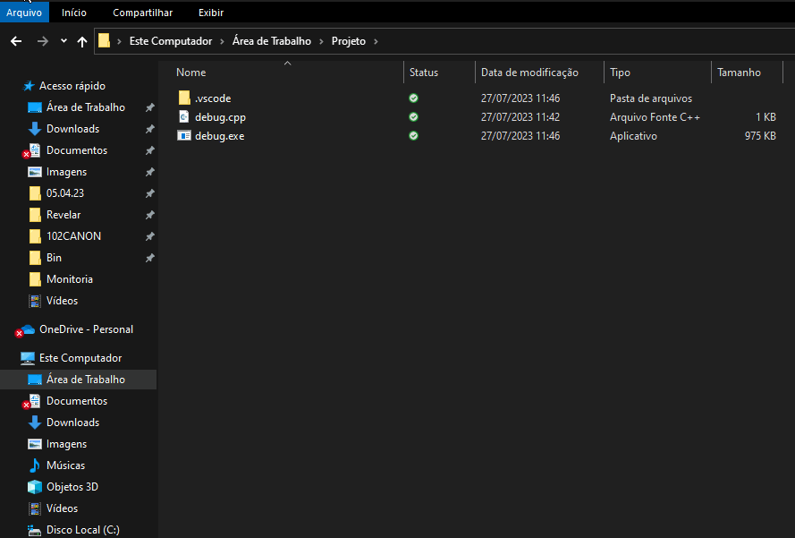
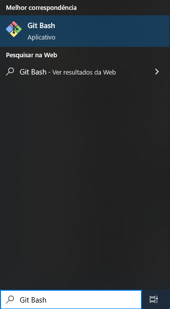
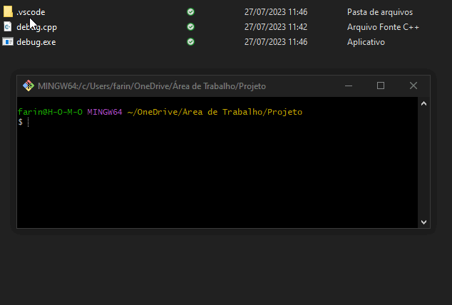
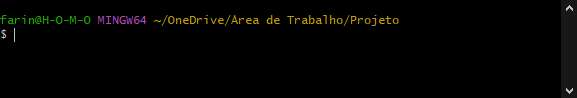
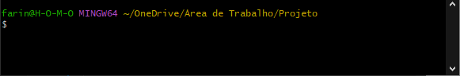
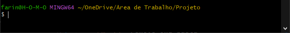
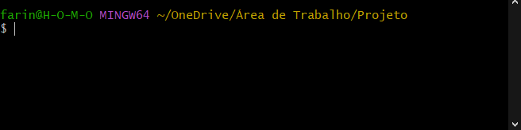
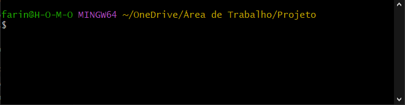

# Bash

<!-- toc -->
- [Windows: Instalando o Git Bash](#windows-instalando-o-git-bash)
  - [Como instalar](#como-instalar)
  - [Como utilizar](#como-utilizar)
- [Utilizando o Bash](#utilizando-o-bash)
  - [Comandos básicos](#comandos-básicos)
  - [Atalhos](#atalhos)
<!-- toc -->

O **Bash** é um interpretador de comandos que permite executar comandos diretamente no terminal. Ele é o interpretador padrão do Linux e do MacOS.

## Windows: Instalando o Git Bash

Como o **Bash** não é o interpretador padrão do Windows, é necessário instalar um programa que o permita ser executado. Para isso, vamos utilizar o **Git Bash**.

### Como instalar

- Baixe por este [link](https://git-scm.com/downloads) e escolha a versão para windows.

- **Execute** o arquivo baixado e siga com os padrões de instalação. Não é necessário alterar nada.

### Como utilizar

- Para abrir o **Git Bash**, basta clicar com o botão direito em uma pasta e selecionar a opção `Git Bash Here`:

    

- Alternativamente, você pode abrir o **Git Bash** pelo **menu iniciar**:

    

  - Porém, ao fazer isso, o Git Bash será aberto na pasta do seu usuário. Para navegar até a pasta desejada, utilize o comando `cd`.

## Utilizando o Bash

O **Bash** tem uma sintaxe muito simples. Para executar um comando, basta escrevê-lo e apertar `Enter`. Exemplificando, para listar os arquivos de uma pasta, basta usar `ls`.
Você pode combinar parâmetros de um comando para alterar seu comportamento. Por exemplo, para listar todos os arquivos de uma pasta, incluindo os ocultos, basta escrever `ls -la`. (`ls -l` + `ls -a`)

### Comandos básicos

- `ls`: lista os arquivos da pasta atual
  - `ls -a`: lista todos os arquivos, incluindo os ocultos
    - Arquivos ocultos são arquivos que começam com um ponto, como `.gitignore`
  - `ls -l`: lista os arquivos com mais detalhes

  

- `cd`: navega entre pastas
  - `cd ..`: volta uma pasta

  

- `mkdir`: cria uma pasta
  - `mkdir -p`: cria uma pasta e todas as pastas necessárias para chegar até ela

  

- `rm`: remove um arquivo
  - `rm -rf` remove uma pasta

  

- `cat`: mostra o conteúdo de um arquivo
  

- `clear`: limpa o terminal

  

- `exit`: fecha o terminal

### Atalhos

- `Ctrl + L`: "limpa" o terminal
- `Ctrl + D`: fecha o terminal
- `Ctrl + A`: vai para o início da linha
- `Ctrl + E`: vai para o final da linha
- `Ctrl + U`: apaga a linha
- `Ctrl + W`: apaga a palavra anterior
- `Ctrl + C`: cancela o comando atual **(IMPORTANTE!!)**
  - Muito útil quando um comando está demorando muito para executar, geralmente é a única forma de cancelá-lo, já que o terminal fica travado enquanto o comando está sendo executado.
