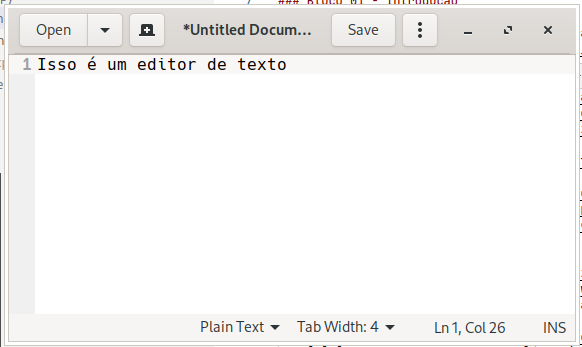
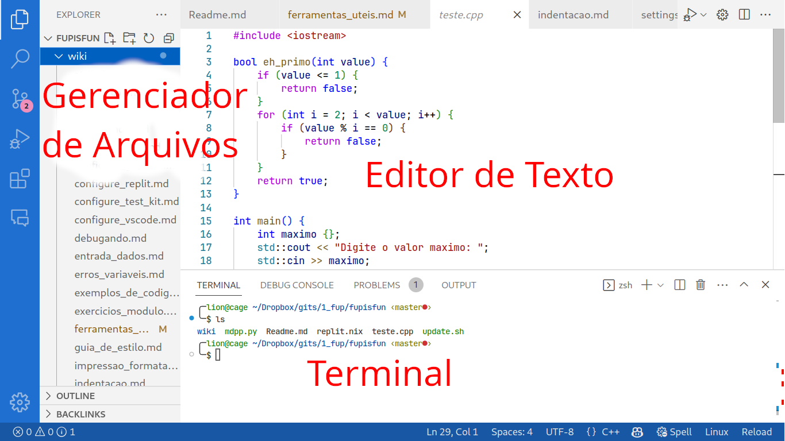

# Ferramentas úteis

<!-- toc -->
- [Explorador de arquivos (File Manager)](#explorador-de-arquivos-file-manager)
- [Terminal](#terminal)
- [Editor de texto](#editor-de-texto)
- [Compilador](#compilador)
- [IDEs](#ides)
- [Usando dispositivos móveis](#usando-dispositivos-móveis)
<!-- toc -->

Quando se trata de programação algumas ferramentas são indispensáveis para um bom desenvolvimento. Entre essas ferramentas estão o **Explorador de Arquivos (File Manager)**, o **Terminal** e um **Editor de Texto (Text Editor)**.

## Explorador de arquivos (File Manager)

Todos os programas que você irá escrever serão salvos em arquivos de texto, dessa forma, é necessário uma maneira de organizar e manipular os arquivos do seu ambiente. Os sistemas operacionais geralmente já possuem um software com essa função: o Windows com o Windows Explorer, o Ubuntu (distribuição Linux) com o Nautilus, e o MacOS com o Finder.

## Terminal

No ambiente da computação é muito comum o uso de ferramentas que não possuem interfaces gráficas (janelas, botões e etc) como você está acostumado a usar. Essas ferramentas são utilizadas por meio de comandos dentro de um software chamado *terminal*. Por meio do terminal também somos capazes de executar várias ações do sistema operacional com comandos, o que pode ser bem eficiente uma vez que você pegue o jeito.

Tanto o Windows, Linux e MacOS já possuem terminais instalados.

## Editor de texto

Como já falado, todos os seus programas são simplesmente arquivos de texto. Dessa forma, um software para edição desses arquivos é essencial para o desenvolvimento.

É importante fazer a separação entre editores de texto e processadores de texto. Os processadores de texto são focados na escrita e formatação, trazendo várias funcionalidades como cores, fontes, alinhamento e etc. Exemplos de processadores de texto são o Microsoft Word e o LibreOffice Writer. Editores de texto são programas mais simples cujo intuito é somente a escrita, sem formatação e estilos.

## Compilador

Um compilador é um programa que transforma o código escrito em uma linguagem de programação em um arquivo executável. O compilador é o responsável por transformar o código que você escreveu em um programa que pode ser executado pelo computador. O C++ utiliza o compilador g++. Outras linguagens possuem seus próprios compiladores ou interpretadores, como o Java que utiliza o javac e o Python que utiliza o python.

Compiladores são executados pelo terminal ou de forma integrada pela IDE.

## IDEs

Uma IDE (Ambiente de Desenvolvimento Integrado) ou em inglês (Integrated Development Environment) é um software que possui um conjunto de ferramentas para auxiliar o desenvolvimento de programas. Geralmente uma IDE possui um editor de texto, um terminal, um explorador de arquivos e um compilador.

## Usando dispositivos móveis

Se você não possui um computador e deseja programar usando um celular ou tablet é recomendado que possua um teclado físico para utilizar no dispositivo. Aparelhos Android são compatíveis com quase qualquer dispositivo que se conecte por Bluetooth ou pela entrada USB. Existem IDEs que rodam diretamente online, como o Replit que possuem aplicativos para celular e neles você pode escrever seu código sem precisar de um computador.

