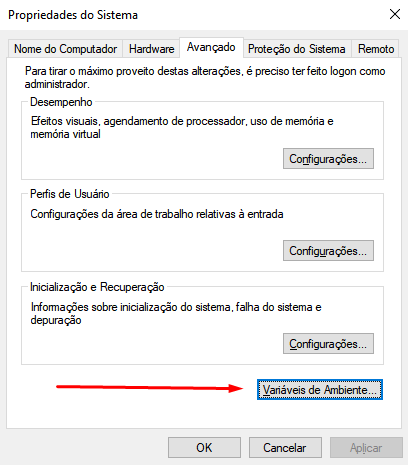

# Configurando o Compilador GCC

<!-- toc -->
- [Windows](#windows)
- [Arch-Based Linux](#arch-based-linux)
- [Debian-Based Linux](#debian-based-linux)
<!-- toc -->

## Windows

- **Instalação do MinGW**
  - Realize o ***[DOWNLOAD](https://github.com/brechtsanders/winlibs_mingw/releases/download/13.1.0-16.0.5-11.0.0-msvcrt-r5/winlibs-x86_64-posix-seh-gcc-13.1.0-mingw-w64msvcrt-11.0.0-r5.7z)***
    - *A versão escolhida é compatível com a última versão do SFML, que poderá ser utilizada no futuro.*

  - Extraia o Arquivo ***"mingw64"*** para o diretório `C:`

  - Após, digite na pesquisa do Windows **"ambiente"** e, em seguida, clique em **"Editar as variáveis de ambiente do sistema"**
    - 

  - Ao abrir, clique no botão **"Variáveis de Ambiente..."**
    - 

  - Na nova janela, você terá que colocar o caminho do mingw na variável ***"Path"***
    - Observe que você terá duas abas, uma para o usuário atual e outra para o sistema. Escolha de acordo com suas necessidades.
    - 

  - Selecione o ***"Path"*** desejado e clique em **"Editar..."**. Uma janela será aberta, clique em **"Novo"** e digite o caminho do mingw. No nosso caso é `C:\mingw64\bin`
    - 

  - Clique em **"OK"** para todas as janelas.

- **Testando a instalação**
  - Abra o terminal do Windows (CMD) e digite

    ```shell
    gcc --version
    ```

  - Deverá aparecer isto:
    - 
  - E pronto, seu compilador para Windows está instalado e configurado.

## Arch-Based Linux

- **Instalando o GCC e o GDB**

```bash
# atualize seu sistema
sudo pacman -Syyu

# instalação das ferramentas de compilação e do gdb
sudo pacman -S base-devel gdb
```

- **Testando a Instalação:**

```bash
gdb --version
gcc --version
```

## Debian-Based Linux

- **Instalando o GCC e o GDB**

```bash
#gdb
sudo apt-get update
sudo apt-get install build-essential gdb

#gcc
sudo apt install -y gcc
```

- **Testando a Instalação:**

```bash
gdb --version
gcc --version
```

Essas instruções orientam a instalação e configuração do compilador GCC (para C) em diferentes sistemas operacionais, semelhante ao que você faria para configurar o G++ (para C++).