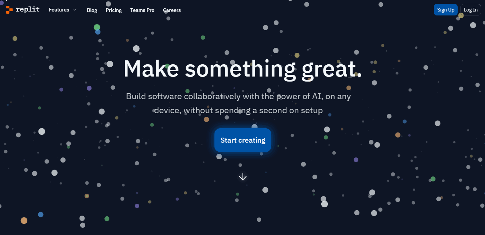
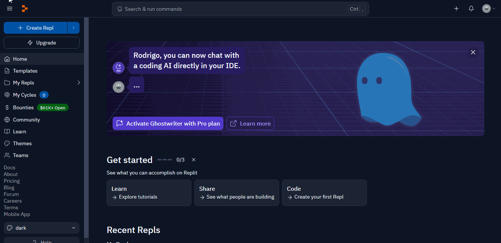
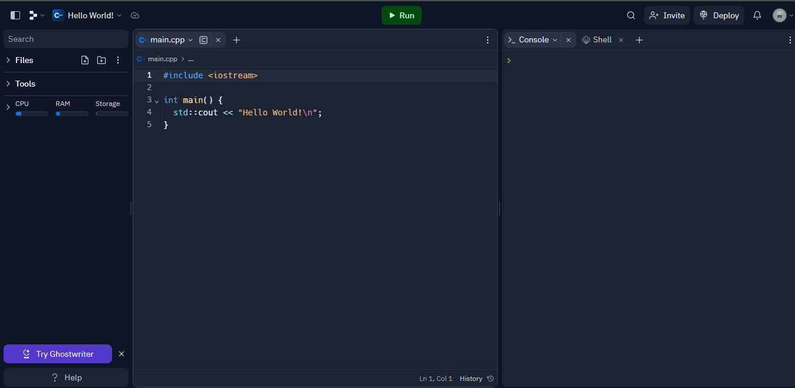
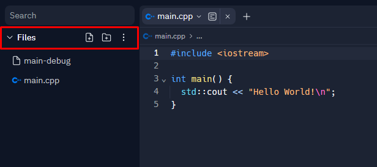
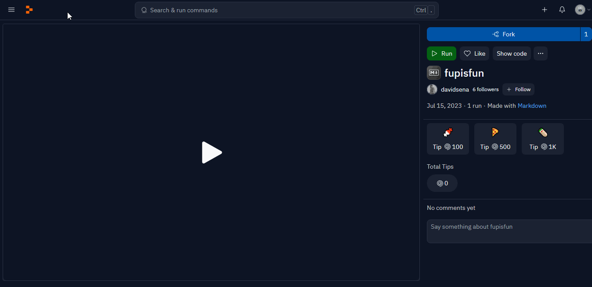

# IDE: Replit

<!-- toc -->
- [Primeiros passos](#primeiros-passos)
  - [Criando uma conta](#criando-uma-conta)
  - [Seu primeiro Repl](#seu-primeiro-repl)
  - [Executando o código](#executando-o-código)
- [Funcionalidades](#funcionalidades)
  - [Criando pastas e manipulando arquivos](#criando-pastas-e-manipulando-arquivos)
  - [Visualizador de CPU, RAM e Armazenamento](#visualizador-de-cpu-ram-e-armazenamento)
  - [Forks](#forks)
<!-- toc -->

O **Replit** é uma IDE online que permite programar em diversas linguagens, incluindo **C++**. Ele é uma ótima opção para quem não quer instalar nada no computador, para sessões colaborativas e para quem quer programar em qualquer lugar.

## Primeiros passos

A plataforma do **Replit** é bem intuitiva e fácil de usar. Iremos fazer o passo a passo de como começar nela.

### Criando uma conta

- Acesse o [site do Replit](https://replit.com/).
- Clique em [Sign Up](https://replit.com/signup)
- Crie uma conta com seu e-mail ou com sua conta do Google.

### Seu primeiro Repl

**Repl** é o nome dado aos projetos no **Replit**.

- Clique em **Create Repl**.
- Na aba `Template` selecione `C++`.
- Dê um nome ao seu projeto e clique em `Create Repl`.

### Executando o código

- Na aba `main.cpp`, escreva o código desejado.
- Clique em `Run` para executar o código.
- A saída será exibida na aba `Console`.

## Funcionalidades

O Replit possui diversas funcionalidades que facilitam a programação. Iremos mostrar algumas delas.

### Criando pastas e manipulando arquivos

- Com o seu Repl aberto, clique na aba `Files` à esquerda. Você verá que já existe um arquivo `main.cpp` criado. Essa aba é o corpo do seu projeto, onde você pode criar pastas e arquivos.

### Visualizador de CPU, RAM e Armazenamento

O Replit possui um visualizador de recursos do sistema para que você possa acompanhar o desempenho do programa.

- **Todo usuário** tem permissão **gratuita** a **0.5 vCPUs**, **512 MiB** (ou 534 MB) de **RAM** e **10 GiB** (ou 10.7 GB) de **armazenamento**.
  - O armazenamento é **compartilhado** entre **todos** os seus **Repls**, use-o com sabedoria.

### Forks

O Replit permite que você faça um **fork** de um projeto, ou seja, você pode copiar o projeto de outra pessoa para o seu perfil. Muito útil para quando você quer fazer um **projeto em grupo** ou quando você quer fazer uma **alteração em um projeto** já existente.

- Iremos fazer o fork do projeto fupisfun. Acesse o [projeto](https://replit.com/@davidsena/fupisfun).
- Clique em `Fork` no canto superior direito.
- Você será redirecionado para o seu perfil com o projeto copiado.

