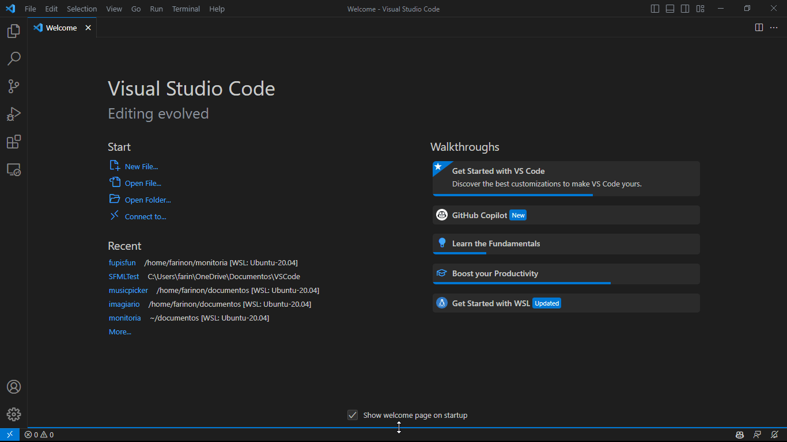
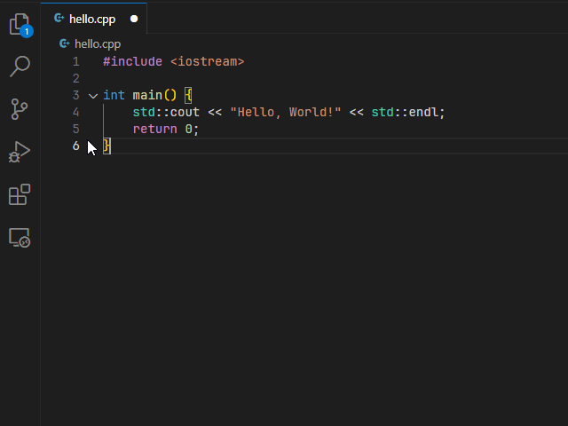
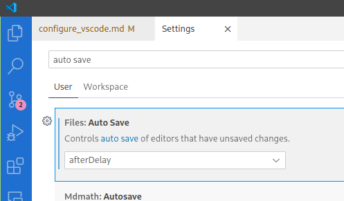
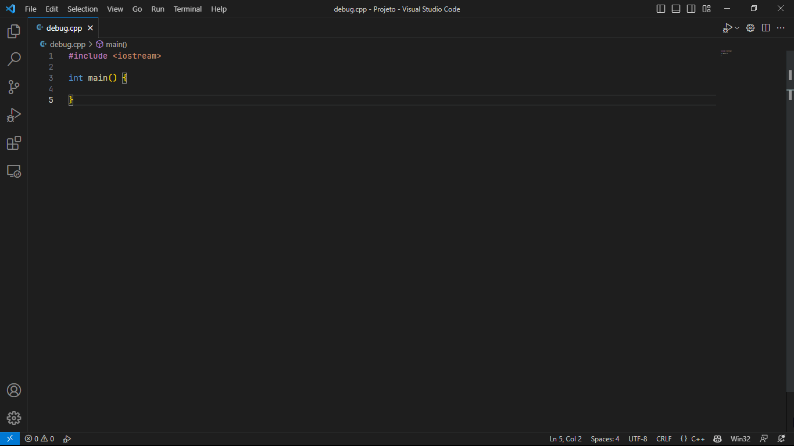

# IDE: Visual Studio Code (vscode)

<!-- toc -->
- [Como Instalar](#como-instalar)
  - [Windows](#windows)
  - [Debian-Based Linux](#debian-based-linux)
  - [Arch-Based Linux](#arch-based-linux)
- [Utilizando o VSCode](#utilizando-o-vscode)
  - [Abrindo o Terminal Integrado](#abrindo-o-terminal-integrado)
  - [Explorer](#explorer)
  - [Usando o Editor de Texto](#usando-o-editor-de-texto)
  - [A configuração mais importante](#a-configuração-mais-importante)
  - [Extensões no VSCode](#extensões-no-vscode)
<!-- toc -->

O Visual Studio Code é uma **IDE (Integrated Development Environment)** desenvolvida pela Microsoft. É uma ferramenta gratuita e de código aberto, que pode ser utilizada para desenvolver em **diversas linguagens de programação**, incluindo **C++**.

## Como Instalar

### Windows

- Baixe por este [link](https://code.visualstudio.com/download) e baixe a versão para windows.
- Execute o arquivo baixado e siga as instruções de instalação

### Debian-Based Linux

- Execute os seguintes comandos no terminal:

  ```bash
  sudo apt update

  #instalando o wget
  sudo apt install software-properties-common apt-transport-https wget

  #baixando a chave de segurança
  wget -q https://packages.microsoft.com/keys/microsoft.asc -O- | sudo apt-key add -

  #adicionando o repositório
  sudo add-apt-repository "deb [arch=amd64] https://packages.microsoft.com/repos/vscode stable main"

  #instalando o vscode
  sudo apt update
  sudo apt install code
  ```

### Arch-Based Linux

- Execute os seguintes comandos no terminal:

  ```bash
  sudo pacman -Syu
  sudo pacman -S code
  ```

## Utilizando o VSCode

### Abrindo o Terminal Integrado

O **Terminal Integrado** é uma ferramenta que permite executar comandos diretamente no VSCode. Para abrir, use a combinação de teclas `Ctrl + '` ou arraste de baixo para cima na aba do terminal.



### Explorer

Para abrir o **Explorer**, use a combinação de teclas `Ctrl + Shift + E` ou clique no **ícone** do Explorer na barra lateral. Você pode usar o Explorer para **navegar** entre os arquivos do seu projeto.



### Usando o Editor de Texto

O editor de texto é a parte principal do VSCode. É onde você vai escrever o seu código, se aproveitando da **sintaxe colorida** e de **atalhos** para facilitar o seu trabalho.

- **Alguns atalhos úteis:**

  - `Ctrl + S`: Salva o arquivo
  - `Ctrl + Z`: Desfaz a última ação
  - `Ctrl + Shift + Z`: Refaz a última ação
  - `Ctrl + K + C`: Comenta a linha selecionada
  - `Ctrl + K + U`: Descomenta a linha selecionada
  - `Ctrl + C`: Copia o texto selecionado
  - `Ctrl + X`: Recorta o texto selecionado
  - `Ctrl + V`: Cola o texto selecionado
  - `Ctrl + F`: Abre a barra de busca
  - `Ctrl + A`: Seleciona todo o texto
  - `Shift + Alt + F`: Formata o código **(MUITO IMPORTANTE!!)**

### A configuração mais importante

Muitas vezes é comum ver os iniciantes escrevendo o código e esquecendo de salvar o arquivo antes de compilar. Então modifique essa opção para colocar o salvamento do código como automático.

- Vá nas configurações do vscode `Ctrl + ,` ou vá pelo menu:
  - Inglês: File -> Preferences -> Settings
  - Português: Arquivo -> Preferências -> Configurações.
- No campo de busca de configuração digite `auto save`.
- Na opção do `auto save` escolha `after delay`.



### Extensões no VSCode

As extensões são ferramentas que podem ser instaladas no VSCode para adicionar funcionalidades.

Para instalar uma extensão, clique no ícone de **extensões** na barra lateral e digite o nome da extensão que você quer instalar. Clique em **instalar** para instalar a extensão.



- **Algumas extensões que iremos usar:**
  - **C/C++**: Adiciona suporte para a linguagem C++
  - **Code Runner**: Permite executar o código diretamente no VSCode.
  - **Error Lens**: Mostra os erros no código sem precisar passar o mouse por cima.
