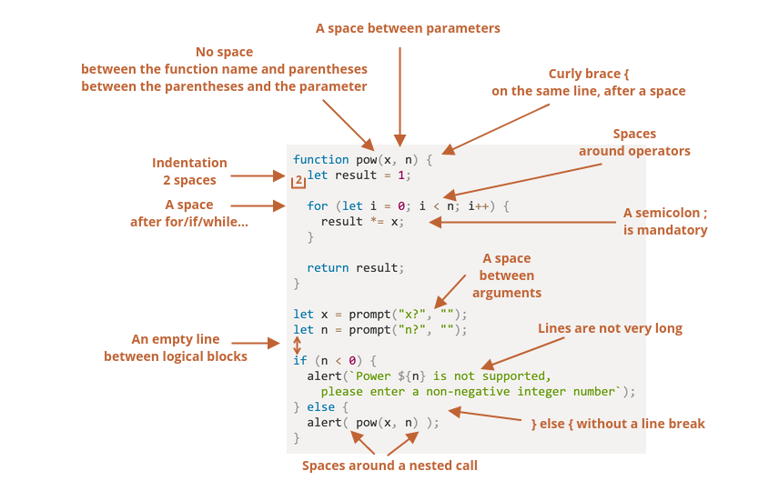

# Estilo

[Guia de estilo javascript](https://javascript.info/coding-style)



Estilo para escrita de código em C++ utilizado nesse curso. O objetivo é manter o código legível e fácil de entender. Mesmo que o compilador consiga entender código feio, é importante que seu código seja legível para humanos. Essas regras de estilo vão deixar seu código mais legível, fácil de entender por você mesmo e por outras pessoas e menos propenso a erros.

## Nomes

- Nomeando funções e variáveis:
  - inicializar em minúscula.
  - usar snake_case ou camelCase desde que mantenha consistência durante todo o código.
  - evitar abreviações desnecessárias nos nomes.
  - evitar acentos.

```cpp
//CORRETO
//utilizando snake_case
int funcao_que_faz_algo(int valor, int tamanho) {
    double nome_da_variavel = 10.0;
    ...
}
```

```cpp
//CORRETO
//utilizando camelCase
int funcaoQueFazAlgo(int valor, int tamanho) {
    double nomeDaVariavel = 10.0;
    ...
}
```

```cpp
//ERRADO
int FuncaoQueFazAlgo(int valor, int tamanho) { //começou com maiúscula
    double nome_da_variavel = 10.0;            //misturou snake_case com camelCase
    ...
}
```

## Regras para variáveis

- inicialize todas no momento em que for criá-las.
- inicialize uma por linha.
- crie apenas no contexto e quando forem necessárias.

```cpp
//ERRADO
int altura, largura;//criei mais de uma por linha e não inicializei
int area; // não inicializei
std::cin >> altura >> largura;

area = altura * largura;
```

```cpp
//CORRETO
int altura {};
int largura {};
std::cin >> altura >> largura;

int area = altura * largura;
```

## Espaços em Branco

- Todo operador binário deve ter um espaço antes e depois.
  - `a + b`
  - `a = b`
  - `a == b`
- Operadores unários não levam espaço.
  - `a++`
  - `a--`
  - `!a`
- Não deixe espaços entre parênteses e seus conteúdos.
  - `(a + b)`
  - `(a == b)`
- Vírgulas não levam espaço antes, mas levam depois.
  - `int a = 0, b = 1, c = 2;`
  - `soma(a, b)`
- Deixe um espaço entre o controle, os parênteses e as chaves;
  - `if (...) {`
  - `for (...) {`
  - `while (...) {`
- Funções e o parênteses não levam espaço.
  - `int soma(int a, int b)`
  - `int x = soma(4, 5)`
- Se tiver `else` na mesma linha do `if`, deixe um espaço entre o `if` e o `else`.
  - `} else {`
  - `} else if (...) {`
- Se seu controle tiver apenas um comando, você pode evitar as chaves, mas sugiro que sempre as utilize.

## Tipos do Usuário

- Nomes de Classes, Enum e Structs.
  - utiliza CamelCase.
  - inicializam em maiúscula.

```cpp
enum DiaDaSemana { Segunda, Terca, Quarta, Quinta, Sexta, Sabado, Domingo };

struct Point {
    int x;
    int y;
};

class Pessoa {
    string nome;
    int idade;
    char letraInicial;
};
```
